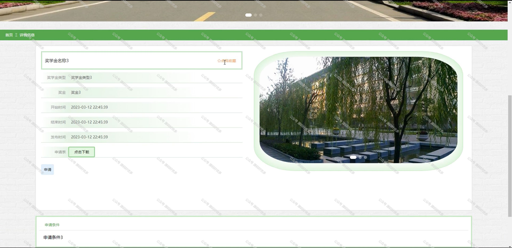
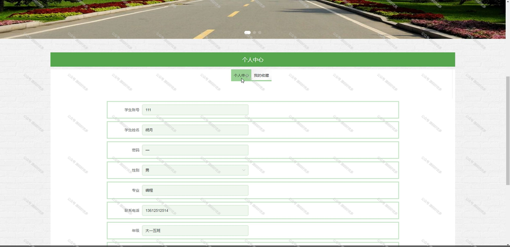
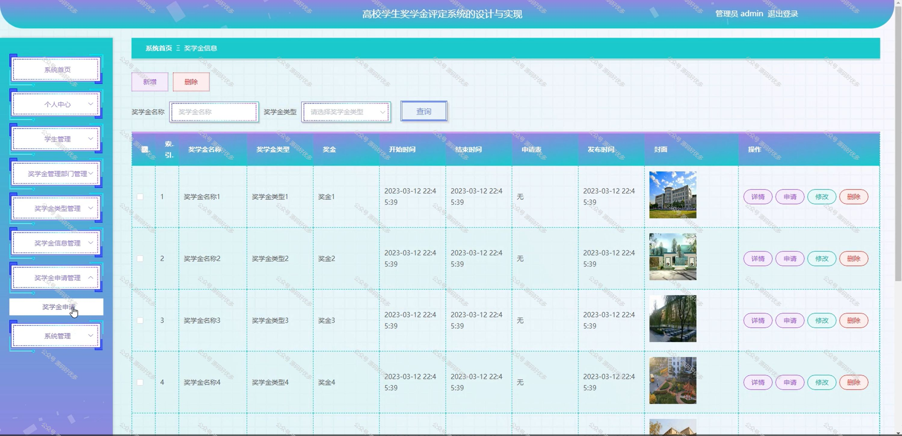
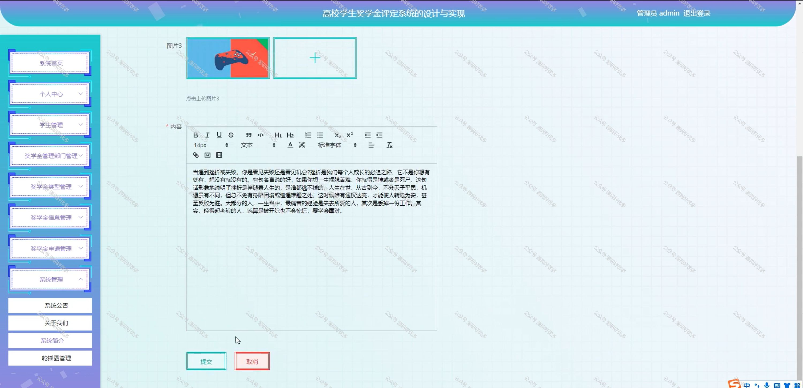

 
## 查看主页获取源码

### 一、作品包含

源码+数据库+全套环境和工具资源+部署教程

### 二、项目技术

前端技术：Html、Css、Js、Vue、Element-ui

数据库：MySQL

后端技术：Java、Spring Boot、MyBatis

  

### 三、运行环境

开发工具：IDEA/eclipse

数据库：MySQL5.7

数据库管理工具：Navicat10以上版本

环境配置软件： JDK1.8+Maven3.6.3

前端Nodejs：14

### 四、项目介绍
项目编号：springbootA174

高校学生奖学金评定系统是为了帮助高校更高效、公平地评定学生的奖学金，激发学生的学习热情，促进校园文化建设而开发的。系统以高校为背景，紧密结合奖学金评定的实际需求，旨在为学校提供一个科学、公正、便捷的奖学金评定和管理平台。通过该系统，提高奖学金评定的透明度和公正性。此外，高校学生奖学金评定系统还具备良好的用户体验和可扩展性，为学校奖学金评定工作提供有力支持。

前台用户功能：浏览首页、奖学金信息、系统公告、后台管理和个人中心。

后台分为管理员、学生、奖学金管理部门
管理员的功能：系统首页、个人中心、学生管理、奖学金管理部门管理、奖学金管理部门、奖学金类型管理、奖学金信息管理、奖学金申请管理、系统管理。
学生的功能：系统首页、个人中心、奖学金申请管理。
奖学金管理部门的功能：系统首页、个人中心、奖学金信息管理、奖学金信息、奖学金申请管理。

### 五、运行截图

  
